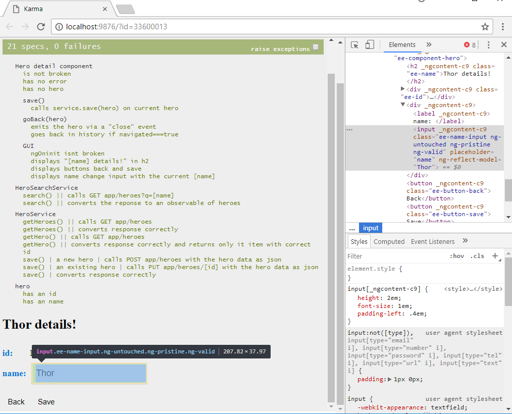

# Testing in Angular

## Conclusion
- Angular is very well testable *(Though there are a few surprises and the doc is bugged a bit)*.

## Summary
- testing a pure TS class
- testing an Angular service
- testing an Angular service and mocking it's dependencies (via jasmine spies)
- testing an Angular component (via TestBed) and mocking it's dependencies
- shallow testing an Angular component (subcomponents are ignored; via NO_ERRORS_SCHEMA)
- e2e testing with protractor
  - using asynch/await to achieve readable protractor tests
  - using special HTML class (eg. .ee-*) to simplify selection by CSS

## Unexpected stuff ##
### Bad ###
- default karma config is bugged (see Technical)
- mocking http is very hard (we must use Observable.defer(), NOT Observable.create())
### Neutral ###
- fixture.detectChanges() also calls .ngOnInit()
- jasmine doesn't need to be imported
- jasmine spy methods do NOT get reset before each test. You must create new spies if you want them fresh.
- ngModel cannot be tested via input.value (because it is simply empty). A special Angular attribute called "ng-reflect-model" can be used instead.
- "npm run e2e" takes ~1min to start and then ~2s per a trivial test case
### Good ###
- karma renders a preview of failing components to help debug the test. Very nice (we can eg. inspect the component via F12).


## Technical ##
- to prevent uncontrollable rage *(because chrome disconnects from karma every two seconds)*, use
```js
// karma.conf.js
browserDisconnectTolerance: 10
```
- don't forget to exclude any test utility files from build compilation
```js
// app/tsconfig.app.json
"exclude": [
  "test.ts",
  "test-utils",
  "**/*.spec.ts"
]
```

### Test Bed ###
Use it to let angular the angular test handle DI for you. However, you obviously need to mock out all the dependencies.

### Shallow testing ###
via NO_ERRORS_SCHEMA - see dashboard.component.spec.ts

## Q & A ##
- do I need GUI tests in components if I use e2e?
  - Yes, they are much cheaper than e2e in terms of change-proofing. (also execution speed)
- why would I use shallow testing? isn't it enough if i just don't test subcomponents?
  - Yes sure you can do that, but just to instantiate a component with many subcomponents you need to import all of them and mock ALL their dependencies. Good luck with that.


## sources ##
[official](https://angular.io/guide/testing)

[jasmine spy cheatsheet](http://tobyho.com/2011/12/15/jasmine-spy-cheatsheet/)

[protractor cheatsheet](https://gist.github.com/javierarques/0c4c817d6c77b0877fda)

[a better way to mock routes (possibly)](https://gist.github.com/benjamincharity/3d25cd2c95b6ecffadb18c3d4dbbd80b)

[best practices](https://github.com/CareMessagePlatform/jasmine-styleguide)

[small isnpiration for e2e best practices](http://techblog.constantcontact.com/software-development/a-better-way-to-id-elements-in-selenium-tests/)

[e2e vs. component GUI tests](https://angular.io/guide/testing#why-not-rely-on-e2e-tests-of-dom-integration)


## Running unit tests ##

Run `ng test` to execute the unit tests via [Karma](https://karma-runner.github.io).
Unit tests use jasmine and TS and that code is run in google chrome browser via karma.

## Make your life easier

I strongly suggets using vscode > File > preferences > User snippets > TS

```js
// press tab to use it!

"Arrow method": {
  "prefix": ">>",
  "body": [
    "($1) => {$2}"
  ],
  "description": "Empty arrow method"
},
"describe": {
  "prefix": "d",
  "body": [
    "describe('$1', ()=>{",
      "$2",
    "});"
  ],
  "description": "Jasmine describe() method"
},
"it": {
  "prefix": "i",
  "body": [
    "it('$1', ()=>{",
      "$2",
    "});"
  ],
  "description": "Jasmine it() method"
},
```

## Jasmine cheat sheet
- version 2.6 jasmine-core (latest is 2.8, but angular packs 2.6)
- name must be *.spec.ts (karma and others expect that)
- describe() ~ test suite (~ tested class)
- it() ~ spec/test case (~ tested method, pre-conditions, post-conditions)
- expect() ~ assert

```js
.toBe() - (===) LATER === or ==?, objects are the same (same internal identifier)
.toEqual() - objects have the same fields
.not.toBe()
.toBeNull()
.toBeUndefined()
.toMatch(/pattern/)
.toContain()
.toBeLessThan()
.toBeGreaterThan()
.toThrowError(TypeError)
    
- beforeEach(), afterEach(), beforeAll(), afterAll()
- fail()
- xit, xdescribe - a way to disable test suite/case
```

### DO NOT USE

```js
.toBeTruthy()
.toBeFalsy()
.toThrow()
```
these are too vague!

### mocking = using spy functions

```js
const instance = new Person();
spyOn(instance, 'getName')                                // calls spy instead of getName()
spyOn(obj, 'method').and.returnValue('Pow!')              // return value by the spy
spyOn().and.callThrough();                                // calls spy and THEN getName()
spyOn().and.callFake(() => {                              // a complex mock
  if (x === 1) return 1;
  else return 10;
});
spyOn().and.throwError(new Error);                        // spy throws error

var dummy = jasmine.createSpy('dummy')                    // a generic spy function, eg. for callbacks
$('button#mybutton').click(dummy)

jasmine.createSpyObj('HttpClient', ['get']);              // a generic spy object with method .get()

expect(obj.method).toHaveBeenCalled()   
expect(obj.method).toHaveBeenCalledWith('foo', 'bar')
obj.method.callCount
obj.method.mostRecentCall.args
obj.method.reset()
obj.method.argsForCall
```

## KARMA ##
- karma spins up a web server, it connects to my browser (can be multiple, can be ghost browser, etc),
karma sends the tests to browsers and they run there (probably websocket or sth)

- how to test a class that uses a global library (eg. jquery):
	- into karma.conf.js > files put sources files that you want loaded
	- in spec.ts files use classic "declare var $:any" *(funny thing: PHPStorm gives an error even thought this works when you run the tests!)*
  [source](https://stackoverflow.com/questions/19263586/global-variables-in-karma-test-runner)

## Protractor e2e ##
Run `ng e2e` to execute the end-to-end tests via [Protractor](http://www.protractortest.org/).
Before running the tests make sure you are serving the app via `ng serve`.

---
<br><br><br><br><br><br>


# Getting Started

Super simple Angular app with 1 module and 2 routes. This is a mnor variation on the Tour of Heroes I wrote for the official docs.

## Get the Code
```
git clone https://github.com/johnpapa/angular-tour-of-heroes.git toh
cd toh
npm i
```

## Development server

Run `ng serve` for a dev server. Navigate to `http://localhost:4200/`. The app will automatically reload if you change any of the source files.

## Code scaffolding

Run `ng generate component component-name` to generate a new component. You can also use `ng generate directive|pipe|service|class|module`.

## Build

Run `ng build` to build the project. The build artifacts will be stored in the `dist/` directory. Use the `-prod` flag for a production build.

## Further help

To get more help on the Angular CLI use `ng help` or go check out the [Angular CLI README](https://github.com/angular/angular-cli/blob/master/README.md).

This project was generated with [Angular CLI](https://github.com/angular/angular-cli) version 1.2.0.

